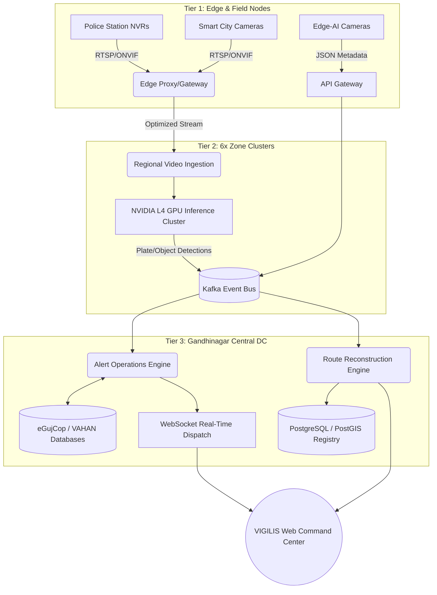

# Gujarat Statewide CCTV Integration Platform
## High-Level Design (HLD)

### 1. Executive Summary
The VIGILIS platform is a mission-critical, hybrid-federated surveillance intelligence hub designed to integrate disjointed camera assets across 26 distinct Gujarat government departments. The architecture bridges heterogeneous Video Management Systems (VMS), proprietary IoT streams, and disparate network topologies into a singular, unified Command Center for real-time law enforcement and civic management.

### 2. Architectural Paradigm: Hybrid Federation Model
Given the immense scale and pre-existing investments in legacy infrastructure, a pure "rip-and-replace" cloud model is unfeasible. We utilize a **Hybrid Federation Model**:
- **Model 1 (Registry Federation):** Existing Smart City IP cameras are registered into our unified GIS tracking database but remain locally hosted.
- **Model 2 (Stream Gateway Federation):** Legacy NVRs push lightweight HLS/MJPEG proxies to our regional ingestion gateways.
- **Model 3 (AI Metadata Federation):** Edge-capable cameras process ANPR locally and transmit only JSON event metadata payloads over the state WAN.

### 3. End-to-End Component Flow

### 4. Cybersecurity & Network Segmentation
- **GSWAN Integration:** All node-to-node communication traverses the Gujarat State Wide Area Network (GSWAN) utilizing MPLS VPNs, completely isolated from the public internet.
- **Zero-Trust Access:** Node authentication via mTLS (Mutual TLS).
- **Data Encryption:** AES-256 for data at rest (Ceph Storage) and TLS 1.3 for data in transit.

### 5. Role-Based Access Control (RBAC) Matrix
- **SuperAdmin (State Home Secretary):** Full state visibility, audit log bypass, system config.
- **Zone Commander (IGP/DIG level):** Full operational control within assigned regional zone (e.g., Surat).
- **Dispatch Operator (Control Room):** Read-only map access, ability to acknowledge and dispatch alerts.
- **Auditor:** Read-only historical data access, no live feed access (to prevent abuse of surveillance).
